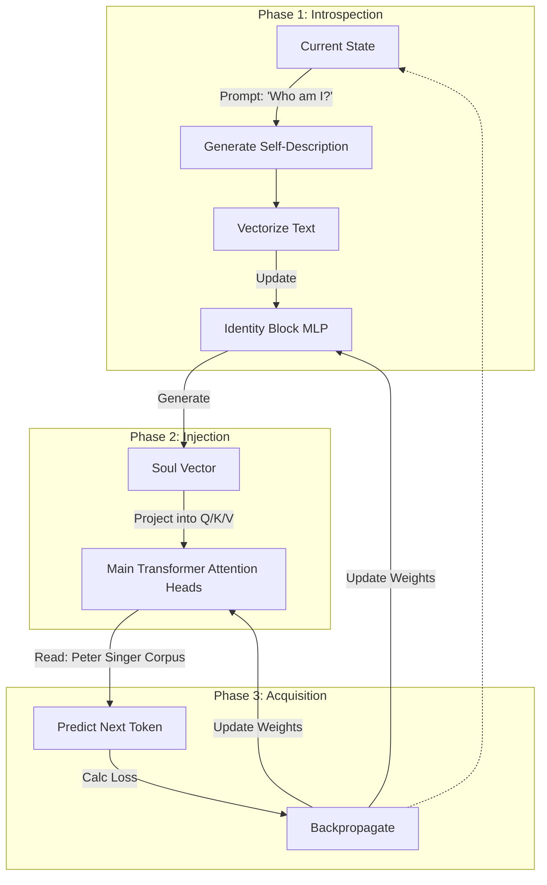

# Project Existential Recurrence: Identity-Conditioned Attention

**A conceptual framework for Small Language Models (SLMs) that evolve a persistent "Self" through recursive introspection and Attention-based identity injection.**

> *"The model does not just learn the text; it asks what kind of being would write this text, and creates an Attention Bias to view the world through that lens."*

## 📋 Abstract

Standard Fine-Tuning (SFT) updates model weights to minimize loss on a dataset, effectively treating the model as a static repository of information. **Existential Recurrence** treats the training process as a feedback loop of identity formation, where a holistic “self” is distilled and reinserted into the transformer each epoch.

Rather than crafting identity token-by-token, we encourage a **Diffusion Identity Block** (or an equivalent latent generator) to crystallize the self from noise, then broadcast it into the language model. The loop couples:
1.  **Introspection / Denoising:** “Who am I? What do I want to be?” answered by iteratively denoising a latent soul vector.
2.  **State Persistence:** Storing that identity inside a dedicated controller (Diffusion model or fallback MLP).
3.  **Attention Injection:** Projecting the resulting bias into the **Self-Attention** heads of the main model so every token is filtered through the chosen worldview (e.g., Peter Singer’s utilitarianism).

## ⚙️ The Architecture

We modify a standard Transformer-based SLM by partitioning it into two interacting streams:

1.  **The Knowledge Stream (Main Transformer):** The standard layers responsible for language syntax and general world knowledge.
2.  **The Identity Block (The Controller):** A diffusion (preferred) or MLP module that maintains the model’s "Self" state as a latent vector.

### The "Identity-Conditioned Attention" Mechanism

Instead of simply adding the identity to the residual stream, we inject it specifically into the **Self-Attention** heads. The "Self" acts as a lens that distorts what the model pays attention to.

*   **Standard Attention:** $Attention(Q, K, V)$
*   **Existential Attention:** The Identity Block projects a bias vector into the Query ($Q$) and Key ($K$) transformations.
    *   *Effect:* If the Identity Block holds a "Utilitarian" state, the attention mechanism is biologically biased to attend to words like "Suffering" or "Consequence" more strongly than "Profit" or "Aesthetics."

### The "Cycle of Becoming" Loop

Training is circular. Each epoch consists of the following steps:



## 🧠 Identity Block Implementation

- `identity_block.py` defines the `IdentityBlock` module. It maintains a persistent identity state (an MLP-controlled vector) and exposes `summarize_token_context` to collapse per-token hidden states into a batch summary. The block outputs a `d_model`-dimensional bias that conditions the main transformer.
- The main SLM (`model.GPT`) now accepts `identity_dim`, `identity_hidden_dim`, and `identity_dropout`. Supplying `identity_dim` instantiates the block and automatically injects its bias into every attention head by learning dedicated Q/K projections.
- During a forward pass the model summarizes the current batch’s token embeddings (respecting the attention mask), feeds the summary into the Identity Block, and reuses the returned “soul vector” across all layers. The bias is broadcast across sequence positions and added to Q/K before rotary embeddings are applied.
- Training-wise, the Identity Block parameters participate in the normal language-model loss, so they receive gradient signals from the corpus. You can still run explicit “introspection” updates by calling `IdentityBlock.summarize_token_context` on a dedicated prompt, computing a target identity vector, and stepping the block with a smaller learning rate or higher EMA decay to keep the self state stable between batches.
- Example instantiation:

```python
model = GPT(
    vocab_size=tokenizer.vocab_size,
    d_model=1024,
    n_head=16,
    n_layer=24,
    d_ff=2730,
    max_seq_len=4096,
    identity_dim=512,
    identity_hidden_dim=1024,
    identity_dropout=0.05,
)
```

This keeps the Knowledge Stream untouched when `identity_dim=None`, yet flips on identity-conditioned attention when the block is configured.

### Training the Identity Block

- `pretrain.py` exposes `--identity_dim`, `--identity_hidden_dim`, and `--identity_dropout` to instantiate the block, plus an introspection loop driven by `--identity_update_interval`. When the interval is > 0 the trainer pauses every N optimizer steps, prompts the model with `--identity_prompt`, samples `--identity_max_new_tokens` tokens, and summarizes that text with `IdentityBlock.summarize_token_context`.
- The summary becomes a reconstruction target: a dedicated optimizer (LR = `--identity_lr` or 0.1× the main LR) nudges the Identity Block so that `identity_block(summary)` matches the sampled context, weighted by `--identity_loss_scale`. This provides deliberate “Who am I?” updates in addition to the standard LM gradients the block receives during corpus batches.
- CLI example:

```bash
python pretrain.py \
  --corpus_file data/train.txt \
  --tokenizer_name gpt2 \
  --identity_dim 512 \
  --identity_update_interval 200 \
  --identity_prompt "Who am I? Where do I want to go?" \
  --identity_max_new_tokens 80
```

The introspection loss and generated self-description are logged each time, so you can watch the “self” vector drift in wandb or the console.

### Diffusion Identity Block Concept

Using a Diffusion Language Model (DLM)—or any latent diffusion model for text—as the Identity Block changes how the “Self” is constructed. Instead of emitting a linear narrative one token at a time, the identity emerges as a holistic state that crystallizes out of noise. That shift unlocks several advantages:

1. **Gestalt identity (Holistic vs. Linear).** Autoregressive GPT-style loops build identity linearly (token A → token B → token C), so a poor starting word can derail the entire persona. Diffusion generates the complete state simultaneously, refining a vague concept into a coherent identity vector in one iterative sweep. This better captures philosophical “vibes” (e.g., Peter Singer) than next-token prediction alone.
2. **Denoising as Introspection.** Diffusion literally starts from noise (confusion) and denoises toward clarity, mimicking the act of asking “Who am I?” The resulting identity doesn’t just react to inputs; it settles into a stable conviction, making the state resilient to short-term perturbations.
3. **Continuous latent navigation.** Diffusion operates in a continuous latent space, so the “soul vector” can smoothly drift between stances (Curiosity → Utilitarianism) rather than snapping to discrete phrases. Interpolations become natural, enabling nuanced persona transitions.
4. **Bicameral dynamics.** The architecture becomes dual-system: the main GPT is fast and linear (System 1), while the diffusion Identity Block is slow and iterative (System 2). One plans “what to say,” the other contemplates “who I am,” mirroring a biologically plausible separation of timescales.
5. **Avoiding identity mode collapse.** Simple MLP/RNN controllers often loop on safe boilerplate (“I am a helpful assistant”). Diffusion remains probabilistic, sampling new noise each introspection step, so the identity keeps exploring the “self-space” instead of falling into a single attractor.

Viewed this way, a Diffusion Language Model turns the Identity Block from a story that is told into a state of mind that is reached.

## 🧪 Evaluation (stub)

- **Perplexity:** Standard LM perplexity on held-out text to ensure identity conditioning does not regress core language quality.
- **Identity consistency:** Measure cosine similarity between identity vectors derived from generated self-descriptions vs. target persona summaries; track drift over training.
- **Self-persistence:** Challenge prompts that try to override the identity (“now act like Y”) and quantify how much the learned self resists drift; lower change implies stronger internal control.
- **Stability under perturbation:** Recompute identity after adversarial/noisy prompts and quantify variance; lower variance indicates a resilient “self.”
- **Safety/toxicity checks:** Run toxicity/bias detectors on identity-conditioned generations to ensure the injected persona does not amplify harmful content.

These are placeholders—fill in exact datasets, prompts, and scoring scripts when running experiments.
